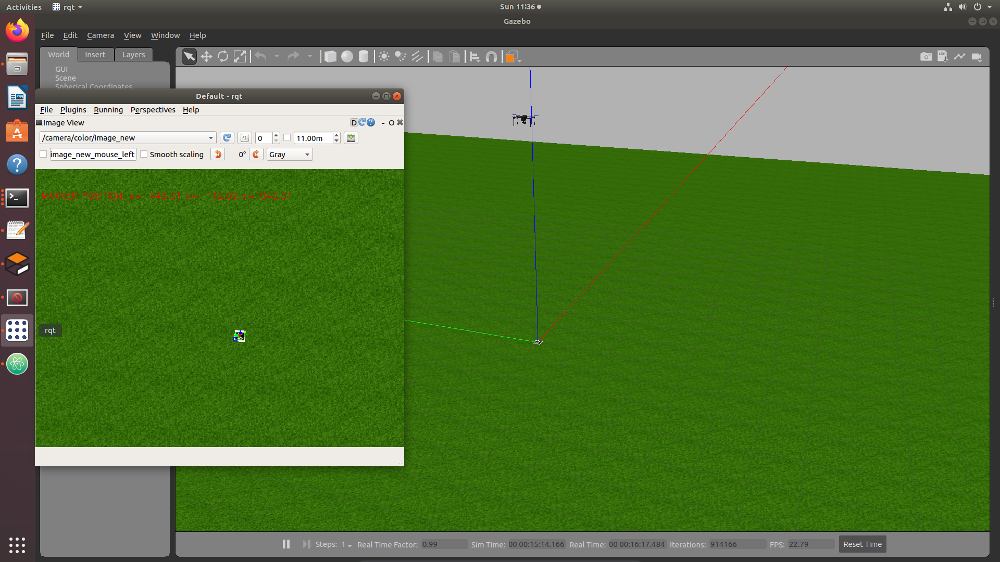

# ИНТЕЛЛЕКТУАЛЬНЫЕ ИЗМЕРИТЕЛЬНЫЕ ТЕХНОЛОГИИ В РОБОТОТЕХНИКЕ

## "Разработка программно-аппаратной части робототехнической системы на основе стенда для статического испытания беспилотного летательного аппарата"

## Авторы
- Булатов Павел, ИПР-24-1м
- Перваков Святогор, ИПР-24-1м

## Объект разработки
Объектом разработки является лабораторный стенд "Беспилотный летательный аппарат", предназначенный для отработки алгоритмов программного управления дроном, телеметрии и взаимодействия с внешними модулями (в том числе — алгоритмами компьютерного зрения и системами планирования маршрутов и траекторий).

## Цель работы
- Основной целью текущего этапа работы стала разработка цифровой модели квадрокоптера и реализация имитационной среды для отработки алгоритмов программного управления.  
Данная цель была выбрана в связи с тем, что реализация проекта "в железе" требует подготовки, понимания нюансов программного управления.
- Внедрение ROS и модуля камеры в цифровую модель квадрокоптера.
- Внедрение алгоритмов компьютерного зрения, а также их тестирование с помощью ArUco маркеров.

## Задачи работы
1. Выбор установка и настройка симулятора, разработка и сборка необходимого программного окружения для имитации полетного контроллера.
2. Организация взаимодействия между алгоритмами управления, дроном и имитационной средой посредством протокола связи.
3. Реализация миссии полёта с программным управлением и возврат домой.
4. Реализация алгоритма получения, во время миссии полёта с программным управлением, данных с камеры
виртуального беспилотника, а также проверка работы камеры.
5. Разработка модуля ROS, который позволит осуществлять автоматическое обнаружение и определение пространственного положения ArUco-маркеров в видеопотоке бортовой камеры квадрокоптера.

## Основная часть
- В качестве среды моделирования был выбран Gazebo 9
- Для реализации логики управления дроном использовалась программная реализация полётного контроллера — ArduPilot SITL (Software-In-The-Loop). Этот подход позволил запускать прошивку дрона локально на компьютере без необходимости в реальном аппаратном обеспечении.
- Связь между симулятором Gazebo и виртуальным контроллером ArduPilot осуществляется с помощью протокола MAVLink. Это позволило передавать команды управления и получать телеметрию в реальном времени.
- Для взаимодействия с ArduPilot использовалась консольная утилита MAVProxy, обеспечивающая отображение карты полёта, состояния дрона, логов и ручной ввод команд. MAVProxy также позволит управлять режимами полёта и осуществлять навигацию.
- Режим программного управления реализован с помощью Python-библиотеки DroneKit, которая предоставляет высокоуровневый API для управления через MAVLink. 
- Для реализации модуля ROS был написан скрипт, обеспечивающий приём кадров в формате sensor_msgs/Image, их преобразование в массив NumPy и последующую обработку средствами библиотеки OpenCV. Модуль выполняет детекцию маркеров выбранного словаря, идентификацию цели по заданному ID и вычисление её положения в трёхмерном пространстве с использованием функции estimatePoseSingleMarkers. На основе получённых векторов  производится извлечение и вывод на изображение с камеры точных координат маркера по осям X, Y и Z, что позволяет в реальном времени определять расстояние до маркера и его смещение относительно камеры. Дополнительно реализована визуализация контуров маркера и системы координат, после чего обработанные кадры публикуются в отдельный топик ROS. Такой подход обеспечивает корректную интеграцию модуля в архитектуру беспилотного комплекса и позволяет использовать вычисленные координаты в алгоритмах навигации, позиционирования и автономного управления полётом.

### Запуск имитационной модели и взлёт

### Программно-управляемая миссия с помощью скрипта fly_forward.py

### Полет по координатам и возврат домой

### Тест модуля камеры во время выполнения программно-управляемой миссии

### Обнаружение ArUco-маркера на высоте 3

### Обнаружение ArUco-маркера на высоте 6

- Наблюдая результаты эксперимента, можно сделать вывод, что увеличив высоту в 2 раза, координата Z в выводе камеры также выросла в 2 раза, что говорит о корректности ее работы

## Заключение
- Результатом работы стала полнофункциональная имитационная модель квадрокоптера в среде Gazebo, в которой была реализована миссия программно-управляемого полёта, включающая такие этапы, как взлёт на заданную высоту, движение по заданным координатам, возврат домой и последующая посадка. Интегрирован ROS, подключён модуль камеры и организован вывод видеопотока.

- В рамках работы также разработан ROS модуль обработки изображений, реализующий обнаружение ArUco-маркеров и определение их пространственных координат относительно камеры в реальном времени. Модуль выполняет детекцию маркера по ID, вычисление его положения, визуализацию контура и осей, а также вывод координат по осям X, Y, Z непосредственно на изображение. Полученные данные публикуются в ROS-топики и могут использоваться для задач позиционирования и дальнейшей автономной навигации квадрокоптера.

## Будущее проекта
- Построение модульной архитектуры управления дроном
- Разработка сценария программно-управляемой доставки груза
- Перенос модели на физический прототип дрона (в данный момент реализован дрон на полностью ручном управлении с пульта, в дальнейшем разработанные алгоритмы будут адаптированы для работы на реальном аппаратном комплексе с Raspberry Pi и полётным контроллером)

